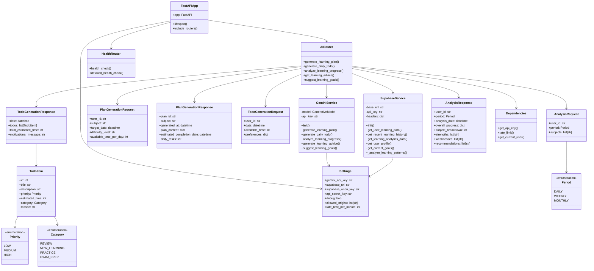

# ChoibenAssist AI Backend - クラス図

## 📐 アーキテクチャ概要

### レイヤー構成
1. **Application Layer**: FastAPI アプリケーション、ルーター
2. **Service Layer**: Gemini AI、Supabase連携サービス
3. **Model Layer**: Pydanticモデル、レスポンス/リクエスト定義
4. **Infrastructure Layer**: 設定、依存関係、認証

### 主要コンポーネント
- **GeminiService**: AI機能の中核、LLMとの通信
- **SupabaseService**: 学習データの取得・分析
- **AIRouter**: AI機能のエンドポイント群
- **Dependencies**: 認証・レート制限などの横断的関心事
